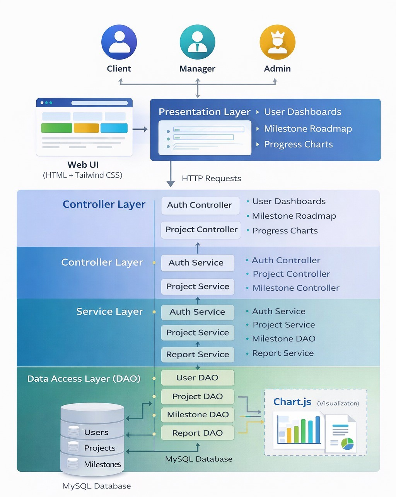
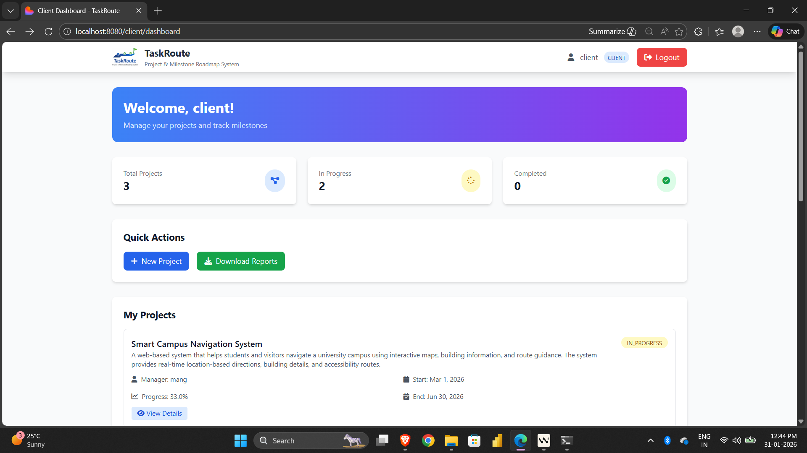
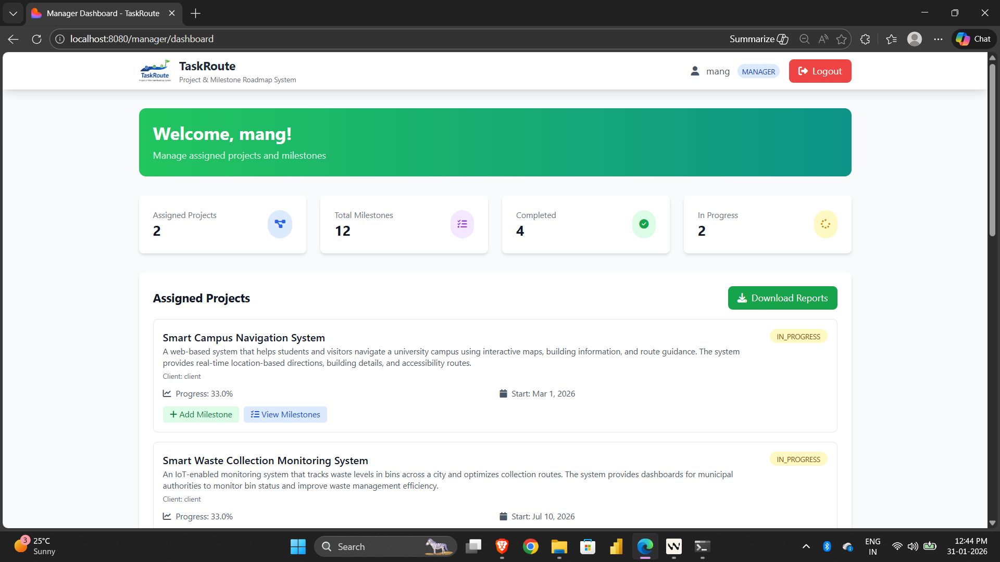
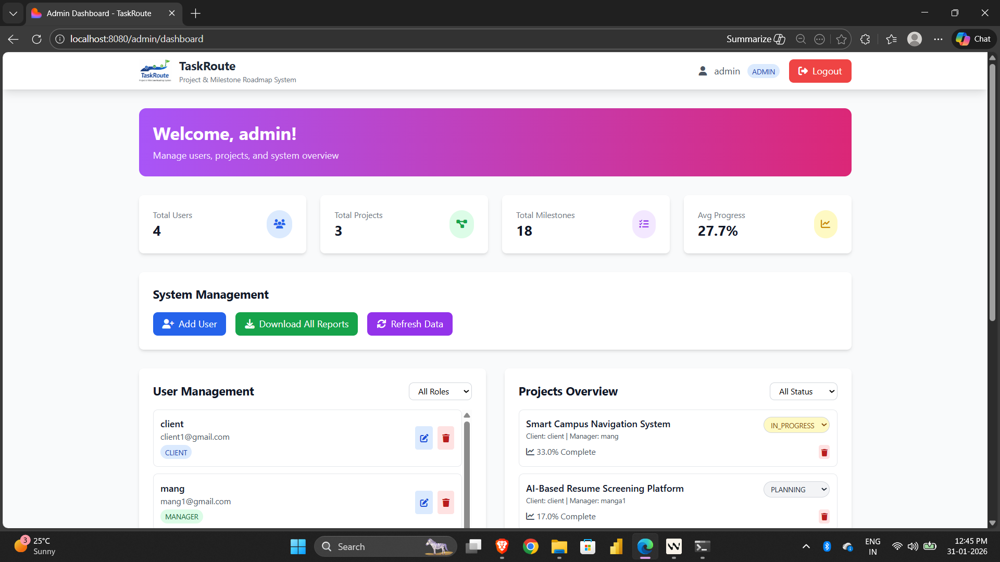
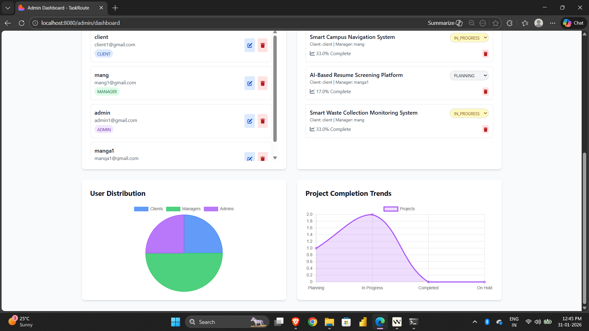
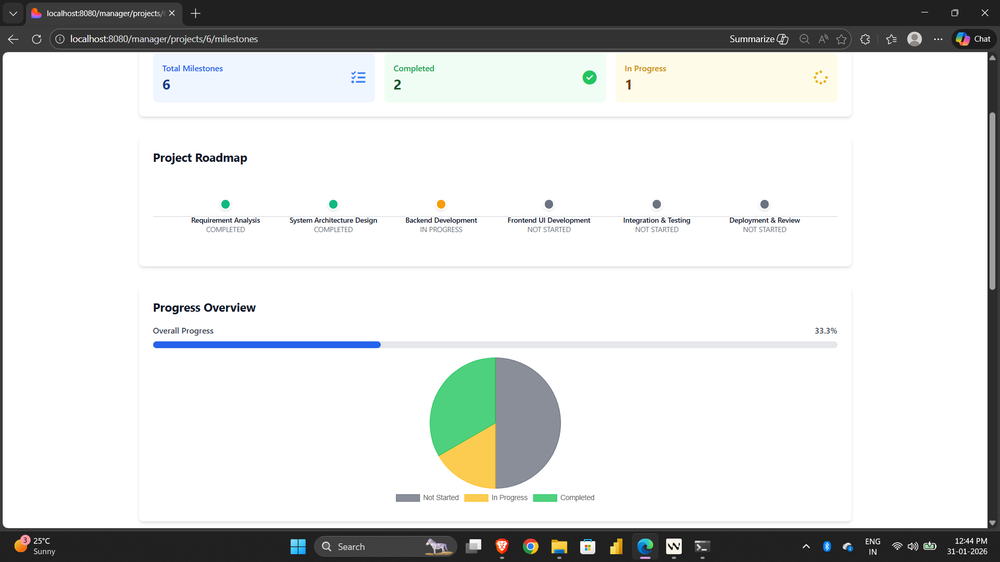

# TaskRoute-Project-Milestone-Roadmap-System
TaskRoute is a **role-based project and milestone tracking mini project** built using **Java, MySQL, HTML, and Tailwind CSS**. It helps **clients, managers, and admins** collaborate effectively by tracking project progress through a clear **milestone roadmap**. This project is designed with real-world workflows and clean system design.

---

## Features Overview

### Role-Based Access
- Client
- Manager
- Admin
- Separate dashboards and permissions for each role

### Client Features
- View client projects on the dashboard
- View project milestones as a roadmap
- Track project progress (milestone-based completion percentage)
- Download client's summary reports (PDF)

### Manager Features
- View assigned projects
- Add/Edit/Delete milestones for assigned projects
- Update milestone status (NOT_STARTED → IN_PROGRESS → COMPLETED)
- View milestone stats (total/completed/in-progress) and recent milestones
- Visualize project and milestone status with charts
- Download manager's summary reports (PDF)

### Admin Features
- Manage users (view/filter by role, delete)
- Manage projects (view/filter by status, delete)
- System overview with analytics and charts
- Download admin's summary report (PDF)

---

## Tech Stack

| Layer | Technology |
|------|-----------|
| Frontend | HTML, Tailwind CSS, JavaScript, chart.js |
| Backend | Java 17, Spring Boot 3.2.0 (MVC, Security), Maven |
| Database | MySQL |
| Reports | iText (PDF generation) |

---

## System Architecture

The application follows a **layered architecture**:
- Presentation Layer (HTML + Tailwind)
- Controller Layer (Java Servlets)
- Service Layer 
- DAO Layer 
- Database Layer (MySQL)

---

## Screenshots 

### Client Dashboard

### Manager Dashboard

### Admin Dashboard

  
  

### Milestone Roadmap View

---

**Note:** This is a mini-project designed for educational purposes. It demonstrates full-stack development with modern Java technologies and responsive web design.
